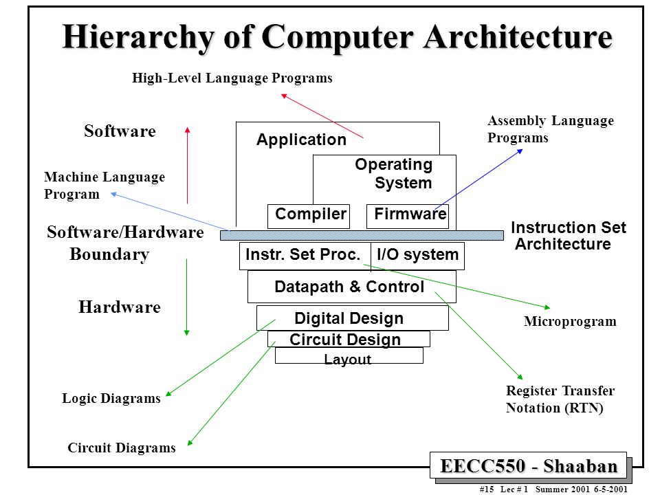

# Welcome
Hello, I will be helping you survive in the world of software engineering/development. This repository was meant for all of us to work together. Other than that, I have changed it so this repository will teach you from knowing nothing to creating your first Application/Project for people to use. There is going to be a lot you will need to know. So, get ready. 

## To Begin  

Your first computer science class should be **CPSC 1050** at Langara I believe. It will teach you the hierarchy of how a computer functions.  

 

  

This picture is similar to what you will learn in class. My class my rules I am skipping it because it is boring asf. We will just be focusing on the **Application** layer. The Application layer is right after the operating system, so it is programs like league of legends, Valorant, and others. But we will be coding it not playing it.  

## Next  

There will be two options you can take for learning to code.  

- Go to University and get a bachelor's degree (any degree works)  

> OR  

- Go to a Coding Boot Camp  

Going to a Coding Boot Camp will be faster and the stuff they teach is good. There are people in the industry who just went to a Coding Boot Camp and got good jobs. The downside is they do not teach you how to problem solve problems with hard questions, most or all the questions you will have to solve yourself, and there is no real way of gaining experience with coding unless it's small projects you create. Also, it cost a lot of money I think I'm not sure about the prices but yeah.   

I prefer the University route because it is more stable, will be longer (sorry), and you get more out of it than just going to a boot camp. Also, there is a co-op which is the best thing ever for free work experience and getting paid for doing the work (Around 18 –30 per/hour maybe depending on what you are doing). There are internships you can apply for as well, some of them do require you to be *Pursuing a bachelor's degree in Computer Science*. I believe you should get paid for doing internships I don’t know though (Some people have told me you do get paid and some say you do not), but the experience of just being part of the company is better than anything. Most or all companies values experience more than anything. So, any projects you have created will be counted as experience and work experience in the industry if you put it on your resume.  

Let me know if you are confused about anything or need help!!  

## Finally  

There are 3 main fields people go into after a degree in computer science. Front-end Developers, Back-end Developers, and Software Developers. There are others like mobile development and game development, but they do not pay as much and require more work. You do not need to know what they are right now, just know they exist, and you will have to pick a field and you can change later if you want. All 3 of these fields use different coding languages just know that.   

Another thing you will need to know is something called **Syntax**. Every language has a different syntax associated with it. The syntax is how you write your code so your compiler can convert it to machine code then your computer can convert it to byte code. You do not need to know how it converts it into Machine code or Byte code just know it does. You will need to know the syntax of any coding language you want to learn.  

> If you are confused, just think about it as someone talking to another person.  

> Person 1 thinks of something they want to say to Person 2. Person 1 then says those things in his head to Person 2. After, Person 2 thinks of what Person 1 said and then comes up with a response to Person 1. Person 2 then says their response to Person 1. Then it repeats. 

Lastly, you will be using something called **Method** or**Functions** a lot. They do the exact same thing and are useful. The only difference is how they are written in every language.  

> Java (Method)  

```  

Public static void nameOfMethod(parameters) {Your code}  

```  

> Python (Def Function)  

```  

def nameOfFunction(parameters):  

Your code  

```  

> JavaScript (Function)  

```  

function nameOfFunction(parameters) {Your code}  

```  

> C++ (Function)  

```  

Void nameOFFunction(parameters) {Your code}  

```  

As you can see, they all start with you needing to declare it as a Method or Function. Then you will need to name the thing and after, they all require round brackets. Then it is the code you want to put in.  

You do not need to know what each one does right now, but just remember that Methods and Functions mean the same things but are written differently.  

There are many more things I could teach you. But I think you should learn a language first. 

That was a lot hope you enjoyed it, but now at the top of the page where the Folders are. You will be going into Getting Started or by clicking this [link](https://github.com/Dreamz2/Training-C/tree/main/Getting%20Started) which will bring you there. Once entered read the following README.md there.  

Let me know if you need help with anything!! 

Good Luck!! 
